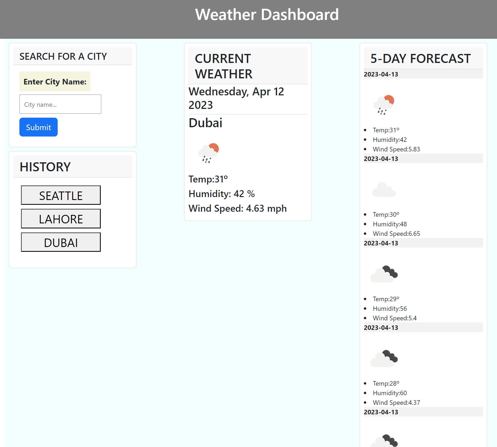

# Weather-Dash

## Overview

In this app, the user enters the name of a city in the search field to display the current weather conditions in that city, including temperature, wind speed and humidity. Additionally, a 5-day forecast for that city is displayed below the current conditions showing similar information.

The app makes use of third-party APIs to access data by making requests with specific parameters to a URL.

## Technologies Used

HTML
CSS
Javascript
Jquery
DOM
Web API

## Code Snippet

...
var queryUrl =
"http://api.openweathermap.org/data/2.5/weather?q=" +
city +
"&units=metric&appid=" +
apiKey;

console.log(queryUrl);

fetch(queryUrl)
.then(function (response) {
console.log(response);
return response.json();
})

    .then(function (data) {
      console.log(data);

      var cityName = document.createElement("h2");
      cityName.textContent = data.name;
      currentContainer.appendChild(cityName);})

In the above snippet, a query is being made to the open weather API using the fetch method then after recieving the data, element h2 is created and appended to a div dynamically to display the searched city name.

## Learning

Retrieving data from another application's API is a powerful tool for developing your apps.

## Deployed Link

https://sabeen44.github.io/Weather-Dash/

## Screen Print

## Code By

Sabeen Chaudhry
